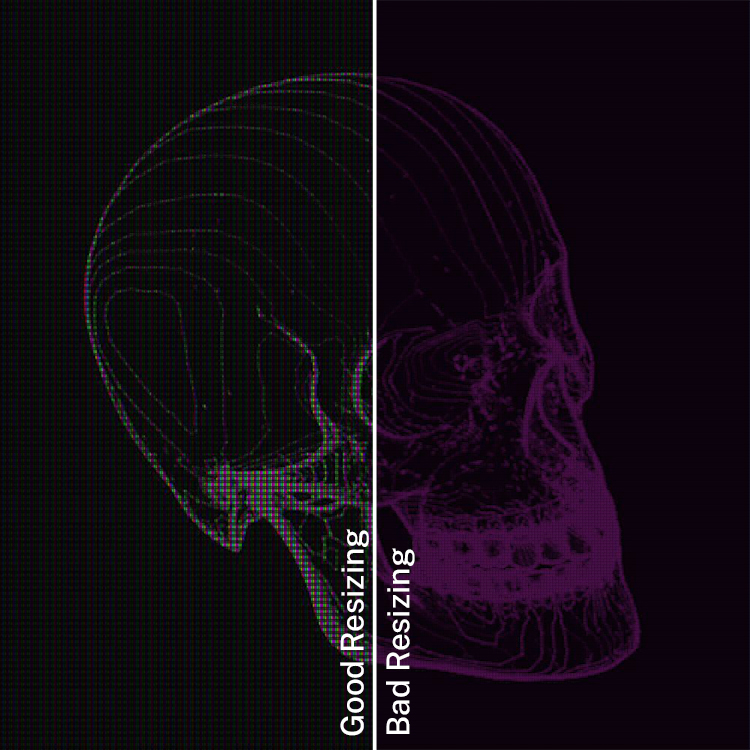

<h3>RGB-Matrix</h3>
Render a display RGB matrix from a source image.

 <h3>Dependency:</h3>

Pillow - <a href="https://pillow.readthedocs.io/en/stable/">https://pillow.readthedocs.io/en/stable/</a>

 <h3>Usage:</h3>
<pre>RGB-Matrix.py [-h] [-f] [-w] [-H] [-b] [-B]</pre>
<pre>positional arguments:
Filename of a single source-image, or directory for batch processing.
 
optional arguments:
-f , --format   Export File-Format (.jpg or .png)
-w , --width    Width of each Individual Pixel (R-G-B).
-H , --height   Height of each individual Pixel (R-G-B).
-b , --block    Block-Size defines the overall size of the repeated Pixel-Pattern.
-B , --black    Shift brightness of black pixels to simulate backlight shining - otherwise no pixels are visible in black areas. Value between 0-100 (0 = black 100 = white)
-rH, --resizedWidth, Width of the resized image. (Optional)
-rH, --resizedHeight, Height of the resized image. (Optional)
</pre>
 

 

If you execute the script without optional arguments, these settings are used:

<pre>-w 2 -H 5 -b 7 -B 0 -f .jpg</pre>

Supported file formats for source image: .bmp, .jpeg, .jpg, .png, .tiff, .tif, .webp
 
<h3>Resizing a Image:</h3>
Consider block size before resizing because resizing applies after the effect is done, so it resizes the final resut not the original file. Result Size (without resizing) = Original Size * Block Size
 
 
First part of the image is resized while considering the result size but the second part of it resized without considering as you see there is significant difference between these two examples so resized image size should be one of the multiples of result size.
 <h3>Tips:</h3>
<ul><li>Two output formats are supported (.jpg & .png). Choosing png as output file format results in a pretty clean matrix, while the compression for .jpg results in a more realistic, organic look.</li><li>A pretty low resolution is recommended for the source image. The effect is more visible that way.</li><li>Sometimes changing black pixel brightness can help getting better results when resizing.</li></ul>
